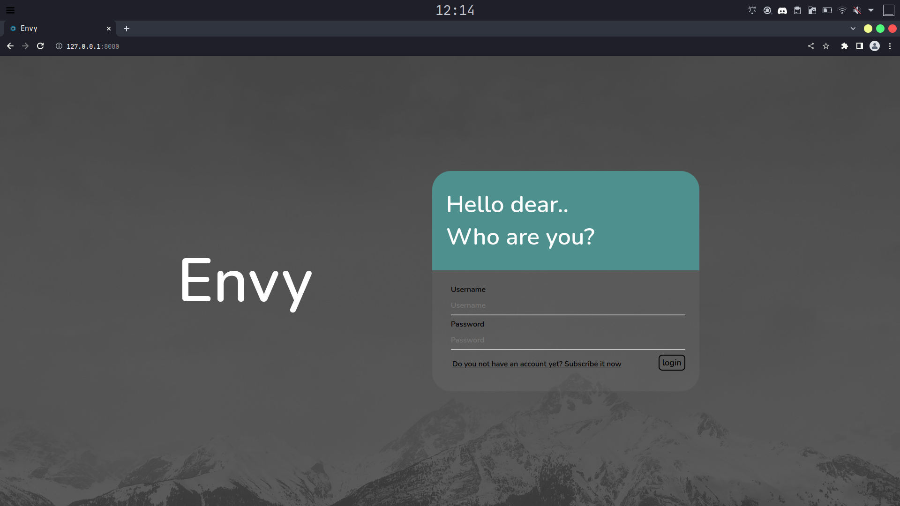
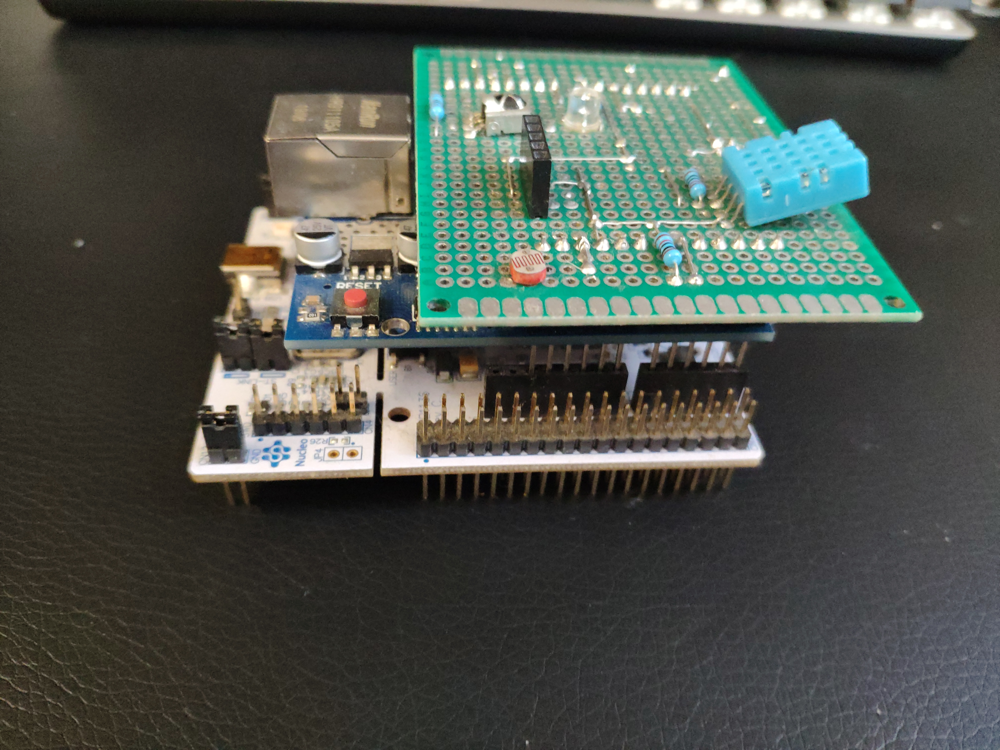

<a name="readme-top"></a>

<br />
<div align="center">

<h1 align="center">Envy</h1>
  <p align="center">
    <br />
    <br />
    <a href="https://github.com/UniCT-WebDevelopment/Envy/issues">Report Bug</a>
    ·
    <a href="https://github.com/UniCT-WebDevelopment/Envy/issues">Request Feature</a>
  </p>

   <a href="https://github.com/UniCT-WebDevelopment/Envy">
    
  </a>
  
  <a href="https://github.com/UniCT-WebDevelopment/Envy">
    
  </a>
   
</div>

<!-- TABLE OF CONTENTS -->
<details>
  <summary>Table of Contents</summary>
  <ol>
    <li>
      <a href="#about-the-project">About The Project</a>
      <ul>
        <li><a href="#mcu-firmware">MCU</a></li>
      </ul>
      <ul>
        <li><a href="#mcu-server">MCU server</a></li>
      </ul>
      <ul>
        <li><a href="#mcu-db">MCU DB</a></li>
      </ul>
        <ul>
        <li><a href="#client-db">Client DB</a></li>
      </ul>
      <ul>
        <li><a href="#home-db">Home DB</a></li>
      </ul>
       <ul>
        <li><a href="#web-server">Web server</a></li>
      </ul>
       <ul>
        <li><a href="#web-app">Web app</a></li>
      </ul>
    </li>
    <li>
      <a href="#getting-started">Getting Started</a>
      <ul>
        <li><a href="#prerequisites">Prerequisites</a></li>
        <li><a href="#installation">Installation</a></li>
      </ul>
    </li>
    <li><a href="#usage">Usage</a></li>
    <li><a href="#roadmap">Roadmap</a></li>
    <li><a href="#contributing">Contributing</a></li>
    <li><a href="#license">License</a></li>
    <li><a href="#contact">Contact</a></li>
    <li><a href="#acknowledgments">Acknowledgments</a></li>
  </ol>
</details>

<!-- ABOUT THE PROJECT -->
## About The Project

Envy is a distribuited-system based on the client-server model that allows you to manage, store and control your home environmental statistics.

## About the system

The system is composed by this entities : 
 
  1. Web server, 
  2. MCU server, 
  3. Device-DB, 
  3. Client-DB, 
  4. Home-DB, 
  5. MCU set, 
  6. Web app.

### Web server 

A express app that present the following feature : 
  
  1. User provisioning :
      
      - sign-up, 
      - login, 
      - change password, 
      - change username,
      - change email, 
      - logout.
  
  2. User's home provisioning : 

      - name,
      - state,
      - city,
      - street,
      - street number,
      - room number.

      2.a room :
        
        - name,
        - floor,
        - sensors.
  
  3. User authentication.
  4. User session.
  5. User home recap (devices, allarms, rooms).
  6. Periodic home enviromental statistic recap.  
  7. Periodic room enviromental statistic recap.  

### MCU server 

A express app that present the following feature : 
  
  1. MCU provisioning :
      
      - sign-up, 
      - login, 
      - sign-up sensors, 

  2. MCU authentication.
  3. MCU session.
  4. MCU status.
  5. MCU allarms.
  6. Warm restart.
  7. Query sensor data. 
  8. MCU-DB management.

### MCU 

Every time time that the server make a request to a specific MCU, the mcu perform the measure that are releated to the request and submit the result. This data are stored by the server into the database.

### Web app

A client, can interact with the system throught a website that allow him to check and display the current status of devices and sensors and monitoring the enviromental statistics.  

### Device-DB 

The database is managed only by the MCU server application.
    
For each MCU store :

- hardware specification
- sensor list 
- network info 
- MCU activity
- planned routine
    
For each sensor store : 

- model
- type

For each measure store :

- result 
- timestamp
- sensor ID

For each routine store :

- related MCU operation
- timestamp creation
- timestamp last enable
- timestamp last disable 
 
### Client-DB 

The client database is managed only by the web-server application.
    
For each web client store :

- username 
- password
- email
- last login
- last logout
- activity time

...

### Home-DB 
    
For each user home store :

- name
- state 
- city
- street 
- room set
- device 
- enviromental statistic

<p align="right">(<a href="#readme-top">back to top</a>)</p>

## Roadmap

- [1]   Develop of Envy board hardware.
- [2]   Develop of Envy board firmware.
- [3]   Setup VM host and networking.   
- [4]   Develop of Envy board server application.
- [5]   Develop of Envy board db.
- [6]   Testing of Envy board db.
- [7]   Debug of server-mcu event handler.
- [8]   Develop of Envy web server application.
- [9]   Develop of client db.
- [10]  Testing of client db.
- [11]  Develop of home db.
- [12]  Testing of home db.
- [13]  Testing of Envy web server application.
- [14]  Develop of Envy web application.
- [15]  Develop of Envy web application.
- [16]  Debug of client-web server event handler.

### Built With

- C++
- Javascript ECMAScript 6
- HTML 5
- CSS
- Love

<p align="right">(<a href="#readme-top">back to top</a>)</p>

<!-- GETTING STARTED -->
## Getting Started

This is an example of how you may give instructions on setting up your project locally.
To get a local copy up and running follow these simple example steps.

## Server requisites

A server machine that is compatible with :  

1. Node.js v14.21.3
2. MongoDB v6.0.5
  
## MCU minimum requisites

One or more mcu with :
  
1. 60 kbyte of ROM.
2. Compatibility with Arduino framework.
3. Network access.
4. ADC 10bit res.
6. 3 GPIO port.

### Components :

One or more of this component : 

1. (0, n) DHT 11/22 digital humidity temperature sensor. 
2. (0, n) HC-SR-501 PIR sensor.
3. (0, n) Photoresistor.
4. (0, n) Led. 

## Libraries

### MCU

- arduino-libraries/Ethernet@^2.0.0
- bblanchon/ArduinoJson@^6.18.5
- adafruit/DHT sensor library@^1.4.3
- ricaun/ArduinoUniqueID@^1.1.0
- khoih-prog/WebSockets2_Generic@^1.9.0

### Webapp

- socket.io
- express.js
- chart.js

### Webserver module

- cookie-parser: 1.4.6,
- cors: 2.8.5,
- express: 4.18.2,
- mongodb: 5.2.0,
- node: 14.20.0,
- socket.io: 4.6.1,
- uuid: 9.0.0

## Prerequisites

1. Download and install Node.js v14.20.3
2. Download and install MongoDB v6.0.5
3. Download and install the Platformio vscode extension.
4. Download the Arduino Framework for your mcu model and all the libraries.
5. Configure the IDE with your device info.
6. Build your board.
7. Flash the envy board firmware.

### Note :

this is the content of the platformio.ino files used in test :
```
[env:nucleo_f401re]
platform = ststm32
board = nucleo_f401re
framework = arduino
lib_deps = 
	arduino-libraries/Ethernet@^2.0.0
	bblanchon/ArduinoJson@^6.18.5
	adafruit/DHT sensor library@^1.4.3
	ricaun/ArduinoUniqueID@^1.1.0
	khoih-prog/WebSockets2_Generic@^1.9.0
upload_protocol = stlink
monitor_speed = 115200
```
### Installation

1. Clone the repo
  ```sh
   git clone https://github.com/UniCT-WebDevelopment/Envy.git
   ```
2. Move to envy dir
  ```sh
    cd download_dir_/envy
  ```
<p align="right">(<a href="#readme-top">back to top</a>)</p>

<!-- USAGE EXAMPLES -->
## Usage

1. Run the server.
  ```sh 
  node app.mjs
  ```

<p align="right">(<a href="#readme-top">back to top</a>)</p>

<!-- ROADMAP -->

See the [open issues](https://github.com/UniCT-WebDevelopment/Envy/issues) for a full list of proposed features (and known issues).

<p align="right">(<a href="#readme-top">back to top</a>)</p>

<!-- CONTRIBUTING -->
## Contributing

Contributions are what make the open source community such an amazing place to learn, inspire, and create. Any contributions you make are **greatly appreciated**.

If you have a suggestion that would make this better, please fork the repo and create a pull request. You can also simply open an issue with the tag "enhancement".
Don't forget to give the project a star! Thanks again!

1. Fork the Project
2. Create your Feature Branch (`git checkout -b feature/AmazingFeature`)
3. Commit your Changes (`git commit -m 'Add some AmazingFeature'`)
4. Push to the Branch (`git push origin feature/AmazingFeature`)
5. Open a Pull Request

<p align="right">(<a href="#readme-top">back to top</a>)</p>


<!-- LICENSE -->
## License

Distributed under the MIT License. See `LICENSE.txt` for more information.

<p align="right">(<a href="#readme-top">back to top</a>)</p>


<!-- CONTACT -->
## Contact

Gianluca Trigili - gianluca.trigili@gmail.com

Project Link: [https://github.com/UniCT-WebDevelopment/Envy](https://github.com/UniCT-WebDevelopment/Envy)

<p align="right">(<a href="#readme-top">back to top</a>)</p>

<!-- MARKDOWN LINKS & IMAGES -->
<!-- https://www.markdownguide.org/basic-syntax/#reference-style-links -->
[contributors-shield]: https://img.shields.io/github/contributors/gianfry3rd/Envy.svg?style=for-the-badge
[contributors-url]: https://github.com/UniCT-WebDevelopment/Envy/graphs/contributors
[forks-shield]: https://img.shields.io/github/forks/gianfry3rd/Envy.svg?style=for-the-badge
[forks-url]: https://github.com/UniCT-WebDevelopment/Envy/network/members
[stars-shield]: https://img.shields.io/github/stars/gianfry3rd/Envy.svg?style=for-the-badge
[stars-url]: https://github.com/UniCT-WebDevelopment/Envy/stargazers
[issues-shield]: https://img.shields.io/github/issues/gianfry3rd/Envy.svg?style=for-the-badge
[issues-url]: https://github.com/UniCT-WebDevelopment/Envy/issues
[license-shield]: https://img.shields.io/github/license/gianfry3rd/Envy.svg?style=for-the-badge
[license-url]: https://github.com/UniCT-WebDevelopment/Envy/blob/master/LICENSE.txt
